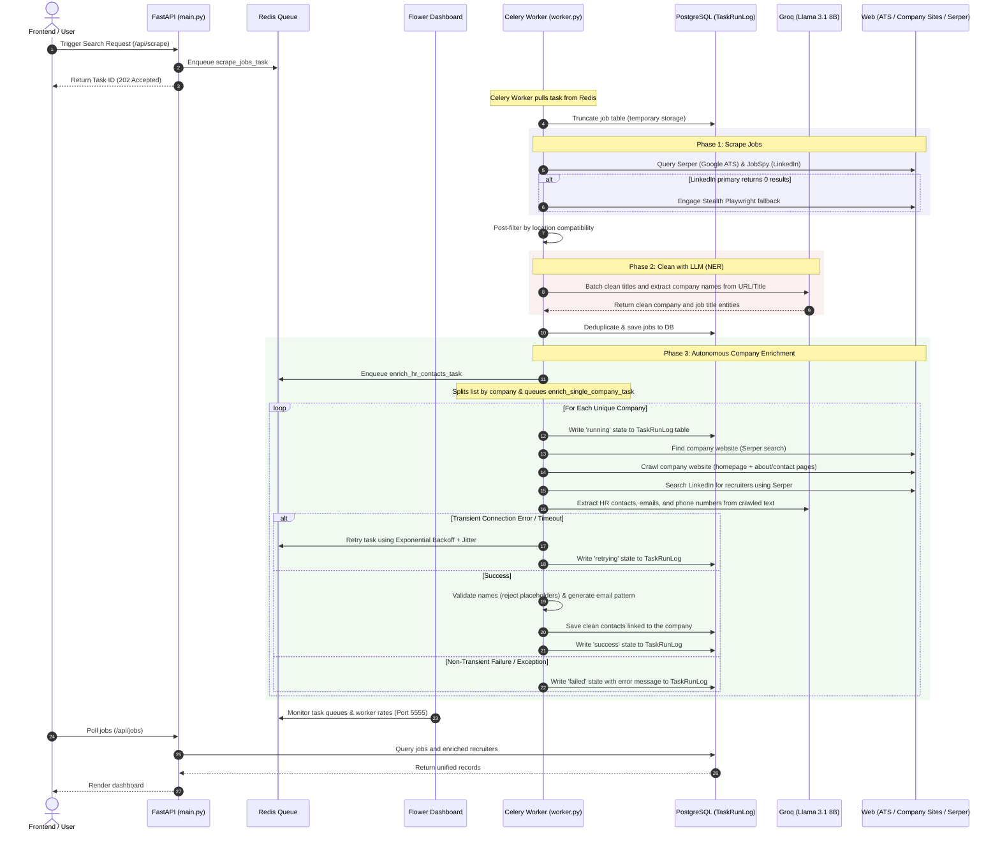

# Job-Scraper-App Backend Architecture Walkthrough

This document provides a detailed, file-by-file technical explanation of the backend architecture, the step-by-step pipeline execution, the role of LLMs, and how the system merges **Generative AI (GenAI)** with **Agentic AI workflows**.

---

## 1. System Pipeline Overview (Start to End)

The diagram below outlines the full lifecycle of a search and extraction task:

---

## 2. File-by-File Code Breakdown

Here is a detailed explanation of the core files in the backend codebase and what they do:

### A. Core & Infrastructure Layer

* **[database.py](file:///d:/Intellativ/4.WebScrapping/backend/app/core/database.py)**
  * **Role:** Manages the database connection lifecycle, engine instantiation, and tables definition.
  * **Key Details:** Defines SQLModel tables for `Job` (storing titles, company name, location, URLs, source) and `Recruiter` (storing recruiter name, job title, email, phone, location, linked company name). Contains safe table creation logic wrapping `SQLModel.metadata.create_all(engine)` in try-except blocks to prevent startup concurrency crashes.
  * **Persistent Audit Logs:** Defines the `TaskRunLog` model which records each Celery task ID, task name, target company, retry counts, errors, and task execution status (`success`, `failed`, `skipped`, `retrying`).

* **[deduplication.py](file:///d:/Intellativ/4.WebScrapping/backend/app/core/deduplication.py)**
  * **Role:** Removes duplicate job entries before insertion.
  * **Key Details:** Computes a unique signature for each job (combining lowercase normalized title, company, and location) and compares it against active records in the database, ensuring only fresh listings are saved.

* **[utils.py](file:///d:/Intellativ/4.WebScrapping/backend/app/core/utils.py)**
  * **Role:** Houses helper utilities.
  * **Key Details:** Handles date normalization (`normalize_date`), country detection (`detect_country`), and country-level location compatibilities (`is_location_compatible`).

---

### B. Scraping Layer

* **[ats_scrapers.py](file:///d:/Intellativ/4.WebScrapping/backend/app/services/scrapers/ats_scrapers.py)**
  * **Role:** Orchestrates targeted searches against applicant tracking systems (Greenhouse, Lever, etc.).
  * **Key Details:** Inherits from `BaseScraper`. Rather than relying on fragile index splits (like `parts[0]` or `parts[-1]`), it uses a unified helper to extract company slugs directly from the URL hierarchy and relies on the downstream LLM to do the final entity cleanup.

* **[google_jobs_service.py](file:///d:/Intellativ/4.WebScrapping/backend/app/services/google_jobs_service.py)**
  * **Role:** Interfaces with Serper (Google Search API) to fetch targeted jobs.
  * **Key Details:** Contains the central URL-to-company helper `_extract_company_from_url_or_title` which parses Greenhouse/Lever subdomains to resolve raw company names safely without breaking on different title string formats.

* **[stealth_playwright_service.py](file:///d:/Intellativ/4.WebScrapping/backend/app/services/stealth_playwright_service.py)**
  * **Role:** Playwright stealth mode browser automation fallback.
  * **Key Details:** Leverages `playwright-stealth` and rotating user-agents to bypass cloud protection mechanisms when direct API routes fail or get throttled.

---

### C. LLM & Enrichment Layer

* **[job_parser_service.py](file:///d:/Intellativ/4.WebScrapping/backend/app/services/job_parser_service.py)**
  * **Role:** Named Entity Recognition (NER) parser for raw jobs.
  * **Key Details:** Submits batches of up to 50 jobs to Llama 3.1 8B. The prompt instructs the model to inspect `title`, `company_raw`, and the `url` structure to isolate clean company names and job titles.

* **[company_enrichment_service.py](file:///d:/Intellativ/4.WebScrapping/backend/app/services/company_enrichment_service.py)**
  * **Role:** Crawls sites and extracts recruiter profiles.
  * **Key Details:** 
    * `_find_company_website()`: Automates finding the official company website domain using search engines.
    * `_scrape_website()`: Crawls the homepage + subpages (About, Team, Careers, Contact) for contact emails.
    * `_run_llm_extraction()`: Prompts Llama 3.1 8B to do NER on crawled context to extract real names, phone numbers, and emails.
    * `_is_valid_person_name()`: Filters out invalid mock contacts (e.g. "Human Resources Manager") returned by the LLM.
    * `_generate_email_from_pattern()`: If an email pattern is detected (e.g. `first.last@company.com`), it automatically reconstructs the recruiter's email.

---

### D. Task Orchestration Layer

* **[worker.py](file:///d:/Intellativ/4.WebScrapping/backend/app/tasks/worker.py)**
  * **Role:** Celery Worker defining task logic.
  * **Key Details:** 
    * `scrape_jobs_task`: Truncates existing tables, runs job scrapers, processes country filtering, calls `JobParserService.parse_job_batch` to perform LLM NER cleaning, saves to the database, and schedules company enrichment tasks.
    * `enrich_hr_contacts_task`: Resolves unique companies and queues individual tasks.
    * `enrich_single_company_task`: Auto-retrying task bound to track transient network anomalies (`requests.exceptions.ConnectionError` and `requests.exceptions.Timeout`) using exponential backoff and jitter. Persists execution states to `TaskRunLog` in PostgreSQL.

---

## 3. The Role of the LLM

The LLM (Llama 3.1 8B via Groq) is used as a cognitive parser. Instead of writing complex regex parsers or string rules for every job board or website layout, the LLM performs:
1. **Named Entity Recognition (NER):** Extracting `Company` and `Job Title` entities out of raw text. E.g., transforming `"ION Group - Senior Python Developer, Risk Technology, Mexico City"` $\rightarrow$ Company: `"ION Group"`, Title: `"Senior Python Developer"`.
2. **Context Parsing & JSON Synthesis:** Digesting up to 7,000 characters of raw scraped HTML/text and mapping found recruiters into structured JSON lists.
3. **Implicit Translation:** Resolving diverse formatting structure rules automatically (e.g. identifying names and roles across multi-lingual pages).

---

## 4. The Agentic AI + GenAI Combination

Your backend is a premier example of how **GenAI** and **Agentic workflows** complement one another:

* **GenAI provides the "Cognition" (Understanding):** Traditional scrapers break when page layouts change. The LLM handles this by reading the content like a human, understanding the semantics, and extracting the needed fields.
* **Agentic Workflows provide the "Autonomy" (Action):** The LLM itself cannot search the web, browse websites, query databases, or execute retries. The backend wraps the LLM in an agentic loop:
  * **Decision Fallbacks:** Autonomously switching to Stealth Playwright if LinkedIn APIs yield 0 results.
  * **Tool Manipulation:** Deciding which search queries to run, crawling external links, verifying email patterns, and checking against database records.
  * **Validation Guardrails:** Using deterministic Python functions (like `_is_valid_person_name()`) to sanity-check the LLM's outputs, preventing hallucinations.
  * **Self-Healing Retries:** Catching connection/timeout exceptions during crawls or API requests and scheduling retry backoffs autonomously.

---

## 5. Evaluation & Prompt Benchmarking

To measure and defend your LLM extraction capabilities to reviewers:

* **Evaluation Framework ([eval_enrichment.py](file:///d:/Intellativ/4.WebScrapping/backend/app/tests/eval_enrichment.py)):** Run `python -m app.tests.eval_enrichment` to test extraction and post-processing quality against a ground-truth dataset. It verifies edge cases like multilingual translations, false positive role name filtering, and email pattern synthesis, and writes a detailed metric report to `eval_report.md`.
* **Prompt Optimization Log ([prompt_optimization_log.md](file:///d:/Intellativ/4.WebScrapping/backend/app/tests/prompt_optimization_log.md)):** Documents exact system prompt modifications, before/after output diffs, and improvements.

---

## 6. How to Convert to a Word Document

Since `python-docx` is not included in the project's dependencies, you can easily save this documentation as a Word Document (`.docx`) using one of the following methods:

### Method A: Copy and Paste (Recommended)
1. Copy the text in this markdown file.
2. Open Microsoft Word.
3. Paste the text. Word will automatically format the headers, lists, and tables correctly.

### Method B: Convert using VS Code (Pandoc / Markdown PDF)
If you have the **Markdown All in One** or **Pandoc** extension in VS Code:
1. Open this file in VS Code.
2. Open the Command Palette (`Ctrl+Shift+P`).
3. Select `Markdown: Export` or `Pandoc: Render Document` and choose `.docx` as the target format.
